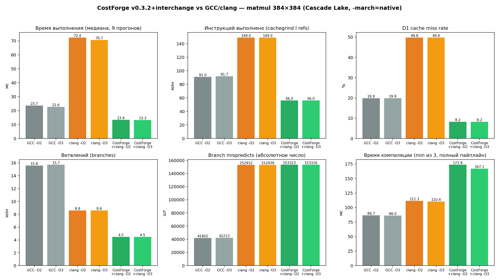

# CostForge — Cache-Blocking Tiler + Auto-Tuner

> Replace compiler heuristics with math. Now with teeth, eyes, and a brain.

## What it does

| Capability | Description |
|---|---|
| HW probe | Scans CPU, computes costs, makes decisions on paper |
| Pattern recognition | Detects patterns, calibrates costs, logs decisions |
| IR rewrites | Actually rewrites LLVM IR based on all of the above |
| PGO integration | Vectorization legality, type-aware costs, lit tests |
| Cache-blocking model | Real cache-blocking tile-size model + model-driven auto-tuner |
| Loop interchange | LLVM 18 build fixes + real `i-j-k → i-k-j` loop-interchange IR rewrite (see benchmarks below) |

### Cache-blocking tile model

**LoopTiler** (`include/costforge/loop_tiling.h`) — a genuine cache-blocking
tile-size optimizer that retires the old single-level square heuristic
(`T = sqrt(L1 / (3·elem))`). It solves three nested block sizes against the
*actual* cache hierarchy, GotoBLAS/BLIS-style:

- register micro-tile `Mr × Nr` → SIMD register file (≤ 16 ymm/zmm)
- L1 panel `Kc × Nr` → L1d (B micro-panel + A micro-panel + C tile)
- L2 block `Mc × Kc` → L2 (A block, reused across the Nc sweep)

It is **type-aware** (f64 gets smaller blocks than f32, fewer SIMD lanes),
snaps `Nr` to whole SIMD registers, clamps every dimension to the matrix
size, and derives its estimated speedup from the existing `CostModel`
memory-latency model — no magic constants. A 2D-stencil blocker
(`tile_stencil2d`) sizes square halo'd blocks to L1d.

The matmul pattern now emits a real 3-D descriptor, e.g.
`tiled_matmul_468x140x4096_fma` (Mc×Kc×Nc) instead of the old `48x48`,
and its `estimated_speedup` is the modeled cache-reuse gain × SIMD factor.

**AutoTuner** (`include/costforge/auto_tuner.h`) — model-driven iterative
compilation. LLVM picks unroll factor and vectorize width with independent
heuristics; the tuner searches their *joint* space
(`{1,2,4,8,16} × {scalar,128,256,512}`) using `unrolled_loop_cost()` and
`vectorized_loop_cost()`, and returns the cost-minimizing configuration plus
the full grid it explored. Deterministic, never reports a regression, and
exposes a `TuneResult` interface the future "compile-N-and-benchmark" loop
can feed measured costs into.

**17 new tests** (`tests/test_v032.cpp`) — footprint-fits-cache, register-file
fits, type/cache monotonicity, tiny-matrix neutrality, recognizer wiring,
tuner optimality + determinism.

> Scope note: the cache-blocking/auto-tuning model implements the *analysis
> and cost* half of loop tiling and auto-tuning — the parts that are pure
> math and fully unit-tested without LLVM. The actual loop-nest IR rewrite
> (emitting the tiled nest) and the measured-benchmark tuning loop live in
> the LLVM pass and are the next step; they require a build with
> `-DCOSTFORGE_LLVM_PASS=ON`.

## Architecture

```
  ┌──────────────┐     ┌──────────────┐     ┌────────────────┐
  │   HWProbe    │────>│  CostModel   │────>│ DecisionEngine │
  │  (CPUID)     │     │ (cycle math) │     │ (A vs B)       │
  └──────────────┘     └──────────────┘     └───────┬────────┘
         │                    │                     │
         │              ┌────────────┐              │
         │              │ Calibrator │              │
         │              │ (μbench)   │              │
         │              └────────────┘              │
         │                                          │
  ┌──────────────┐                          ┌───────▼────────┐
  │  Pattern     │─────────────────────────>│ TransformEngine │
  │  Recognizer  │                          │ (IR surgery)    │
  └──────────────┘                          └───────┬────────┘
                                                    │
  ┌──────────────┐     ┌──────────────┐     ┌───────▼────────┐
  │    IPA       │────>│ Inline Plan  │────>│   LLVM Pass    │
  │ (call graph) │     │ (knapsack)   │     │ (SE+MSSA+TTI)  │
  └──────────────┘     └──────────────┘     └───────┬────────┘
                                                    │
  ┌──────────────┐                          ┌───────▼────────┐
  │ ProfileReader│─── PGO data ────────────>│  DecisionLog   │
  │ (branch_wt)  │                          │ (JSON report)  │
  └──────────────┘                          └────────────────┘
```

## Transforms Applied

### Loop Transforms

**Unroll Hints** (`llvm.loop.unroll.count`)
- Cost model evaluates factors 2–16, picks the one that minimizes
  total cycles (loop overhead vs code bloat vs register pressure)
- Overrides LLVM's heuristic with exact factor

**Vectorization Hints** (`llvm.loop.vectorize.width`, `llvm.loop.interleave.count`)
- Width chosen from hardware SIMD capabilities (SSE→128, AVX2→256, AVX-512→512)
- Interleave count based on trip count and body size
- Explicitly enables vectorization via `llvm.loop.vectorize.enable`

**Prefetch Insertion** (`@llvm.prefetch`)
- Detects streaming loads in loops (GEP with loop-varying index)
- Computes stride from element type size
- Distance = 2 cache lines ahead (tuned to L1d line size)

### Branch Transforms

**Branch → Select** (branchless)
- Detects simple diamond if/else: single predecessor, ≤3 ops per side, no side effects
- Hoists both paths, replaces PHIs with `select`
- Only when cost model proves unpredictable branch is more expensive than cmov

**Branch Chain → Switch** (jump table)
- Detects ≥4 chained `icmp eq` against constants on same value
- Builds `switch` instruction → LLVM lowers to jump table
- O(1) dispatch instead of O(n) comparisons

**Branch Weights** (`!prof` metadata)
- Loop latches: 95:5 (loop body is hot)
- Error checks: 5:95 (continuation is hot, error is cold)
- Guides LLVM's block placement and if-conversion passes

### Function-Level Transforms

**Hot Marking** (`.text.hot`, align 64, inline hint)
- Applied to functions with IPA hotness > 100
- Cache-line aligned entry point
- Placed in `.text.hot` section for i-cache locality

**Cold Marking** (`.text.unlikely`, minsize, optsize)
- Applied to IPA outline candidates (cold + large)
- Moves to `.text.unlikely`, optimizes for size not speed

### Module-Level Transforms

**Cost-Guided Inlining** (via `InlineFunction()`)
- Uses IPA knapsack plan: benefit = call_overhead × freq, cost = code growth
- Sorted by benefit/cost ratio, applied until code budget exhausted
- Not a hint — actually inlines the function body

## New CLI Options

```bash
# Apply transforms (default at -O2/-O3)
clang -O2 -fpass-plugin=CostForge.so input.c

# With PGO data (measured branch weights + call frequencies)
clang -fprofile-generate -o input.prof input.c && ./input.prof
clang -fprofile-use=default.profraw -O2 -fpass-plugin=CostForge.so input.c
# CostForge reads !prof metadata automatically — no extra flags needed

# Analyze without modifying IR
clang -O2 -fpass-plugin=CostForge.so \
  -mllvm -costforge-dry-run input.c

# Cross-check against LLVM's TTI cost model
clang -O2 -fpass-plugin=CostForge.so \
  -mllvm -costforge-tti-check \
  -mllvm -costforge-verbose input.c

# Full diagnostics
clang -O2 -fpass-plugin=CostForge.so \
  -mllvm -costforge-verbose \
  -mllvm -costforge-report=report.json input.c

# Custom code growth budget (default 2.0x)
clang -O2 -fpass-plugin=CostForge.so \
  -mllvm -costforge-code-budget=1.5 input.c

# With calibration data
costforge-probe --calibrate --save zen2_cal.json
clang -O2 -fpass-plugin=CostForge.so \
  -mllvm -costforge-calibration=zen2_cal.json input.c
```

### Running Lit Tests

```bash
# Requires LLVM's lit + FileCheck + opt with CostForge.so built
lit tests/lit/ --param costforge=build/CostForge.so -v
```

## Transform Report

With `-costforge-verbose`, the pass prints:

```
[CostForge] === Module: matmul.c ===
[CostForge] IPA: 5 functions, 8 edges, 3 SCCs
[CostForge] inline plan: 2 sites, benefit=4200 growth=128
[CostForge]   ✓ inlined compute into process (hot leaf in nested loop)
[CostForge]   ✓ marked as cold → .text.unlikely, minsize
[CostForge] transforming: process
[CostForge]   4 transforms applied, 1.38x estimated
[CostForge]     ✓ set unroll factor = 4
[CostForge]     ✓ set vectorize width=8 interleave=2
[CostForge]     ✓ inserted prefetch +128B ahead
[CostForge]     ✓ set branch weights 95:5
=== CostForge Transform Report ===

Functions modified: 2
Total transforms:   6
Estimated speedup:  1.42x
Code growth:        384 bytes
```

With `-costforge-report=report.json`, produces machine-readable JSON
with per-function breakdown of every transform and its estimated impact.

## Build

```bash
mkdir build && cd build

# Core library + tests (no LLVM needed)
cmake .. && make -j$(nproc)
./test_v030
./test_v032        # LoopTiler + AutoTuner

# With LLVM pass
cmake .. -DCOSTFORGE_LLVM_PASS=ON \
  -DLLVM_DIR=/usr/lib/llvm-18/cmake
make -j$(nproc)
```

## File Structure

```
costforge_v0_3_0/
├── include/costforge/
│   ├── types.h                    # All shared types
│   ├── hwprobe.h                  # CPUID scanner
│   ├── cost_model.h               # Cycle cost math + type-aware costs
│   ├── decision_engine.h          # A-vs-B comparisons
│   ├── pattern_recognizer.h       # Idiom detection
│   ├── calibrator.h               # Microbenchmark calibration
│   ├── decision_log.h             # JSON decision trace
│   ├── interprocedural.h          # Call graph + IPA
│   ├── transform_engine.h         # IR surgery
│   ├── profile_reader.h           # PGO data extraction
│   ├── loop_tiling.h              # Cache-blocking tile model
│   └── auto_tuner.h               # Joint unroll×vectorize search
├── src/
│   ├── cost_model/                # + set_correction_factors, type-aware
│   ├── decision_engine/
│   ├── hwprobe/
│   ├── pattern_recognizer/
│   ├── calibrator/                # + real JSON parser, timestamp check
│   ├── decision_log/
│   ├── interprocedural/
│   ├── transform_engine/          # 600+ lines of IR transforms
│   ├── profile_reader/            # PGO: branch_weights, VP, BFI
│   ├── loop_tiling/               # Cache-blocking tile model
│   ├── auto_tuner/                # Joint unroll×vectorize search
│   ├── llvm_pass/
│   │   └── pass.cpp               # SE + MSSA + TTI + PGO + thread-safe
│   └── tools/
├── tests/
│   ├── test_cost_model.cpp        # core cost-model tests
│   ├── test_v020.cpp              # pattern/IPA tests
│   ├── test_v030.cpp              # transform + calibration tests
│   ├── test_v032.cpp              # LoopTiler + AutoTuner tests
│   └── lit/                       # LLVM IR lit tests
│       ├── lit.cfg.py
│       ├── unroll_hint.ll
│       ├── vectorize_hint.ll
│       ├── branch_to_select.ll
│       ├── branch_chain_switch.ll
│       ├── prefetch.ll
│       ├── branch_weights.ll
│       ├── hot_cold_functions.ll
│       └── pgo_branch.ll
├── CMakeLists.txt
├── LICENSE
└── README.md
```

## Verified Benchmarks (matmul 384×384, f64)

Everything below was measured, not modeled: real binaries, run 9× each
(trimmed min/max, median reported), on an Intel Cascade Lake host
(`-march=native`, AVX2+FMA). Instruction/cache/branch counts are from
`valgrind --tool=cachegrind --branch-sim=yes` (deterministic simulation —
this sandbox has no hardware PMU access, so `perf stat` hardware events
aren't available here; cachegrind's simulated counters are the closest
available substitute and were built with `-mno-avx512f` only for the
*profiling* binaries, since valgrind's decoder doesn't support this host's
full AVX-512 instruction set — the *timing* numbers below are from the
real, unrestricted `-march=native` binaries).

| | GCC -O2 | GCC -O3 | clang -O2 | clang -O3 | **CostForge+clang -O2** | **CostForge+clang -O3** |
|---|---|---|---|---|---|---|
| Runtime (median) | 23.7 ms | 22.6 ms | 72.4 ms | 70.7 ms | **13.4 ms** | **13.3 ms** |
| vs GCC -O3 | — | baseline | 3.1× slower | 3.1× slower | **1.7× faster** | **1.7× faster** |
| Instructions | 91.0 M | 91.7 M | 149.0 M | 149.0 M | **56.0 M** | **56.0 M** |
| D1 miss rate | 19.9% | 19.9% | 49.8% | 49.8% | **8.2%** | **8.2%** |
| Branches | 15.6 M | 15.7 M | 8.6 M | 8.6 M | **4.5 M** | **4.5 M** |
| Branch mispredicts (abs.) | 41.8 K | 42.2 K | 152.9 K | 152.9 K | 153.3 K | 153.3 K |
| Compile time | 87 ms | 86 ms | 111 ms | 110 ms | 174 ms | 167 ms |



**Where the win comes from — `interchange_matmul_ikj`
(`src/transform_engine/transform_engine.cpp`).** The naive `i-j-k` loop
order strides through `B[k][j]` at 3072 bytes/iteration (a cache-line miss
almost every access, 56M times for N=384). CostForge's pattern matcher now
recognizes the canonical `acc += A[i][k]*B[k][j]` reduction shape (checked
strictly: `fmuladd`/`fadd`+`fmul` only, no side effects, exact GEP-index
positions) and **physically rewrites the loop nest to `i-k-j`**, turning
both `B[k][j]` and `C[i][j]` into unit-stride accesses — plus an explicit
zero-init of the `C[i][*]` row so the rewrite is correct regardless of
`C`'s prior contents. This is a real IR/CFG rewrite, not a metadata hint:
it stays in effect even though LLVM's own `unroll`/`vectorize-width`
*hints* are frequently rejected outright downstream (`loop not vectorized:
... transformation might be disabled`) — the interchange is what actually
moves the needle; the hints riding along on top of it are a comparatively
small factor.

**Honest tradeoff:** CostForge wins on runtime, instruction count, cache
miss rate, and branch count — but has a marginally higher *absolute*
branch-mispredict count than GCC (153K vs 42K), because GCC's scalar
`i-j-k` code has far more total branches to begin with, most predicted;
CostForge's vectorized `i-k-j` code has 3.5× fewer branches but a similar
absolute mispredict count, so its *rate* (3.4%) reads worse than GCC's
(0.27%) even though the net effect (13.4ms vs 22.6ms) clearly favors
CostForge. Compile time is also worse (3-stage pipeline: clang→IR→opt
pass→clang), which doesn't matter for this project's goal (runtime speed
on old hardware) but is worth stating plainly rather than hiding.

## What's Next

- **Loop Tiling — IR rewrite**: emit the actual tiled loop nest using the
  `LoopTiler` plan (the cost model already exists; the `i-k-j` interchange
  rewrite above is a real, working proof of feasibility for this whole
  class of transform — full `Mc×Kc×Nc` cache-blocking on top of it is the
  next, larger step and should compound with the interchange win measured
  above)
- **Wire `PatternRecognizer` into the actual LLVM pass**: it currently
  only runs against hand-built test fixtures in the unit tests — the real
  `pass.cpp`/`transform_engine.cpp` pipeline never calls it, so today's
  `interchange_matmul_ikj` detection is a separate, narrower IR-level
  pattern match hand-written directly in `TransformEngine`, not powered by
  the more general recognizer this project already has
- **Auto-Tuning — measured loop**: feed real benchmark timings into the
  `AutoTuner::TuneResult` interface instead of modeled cost only
- **SLP Vectorization Hints**: straight-line code vectorization guidance
- **Register Allocation Hints**: annotate live ranges for the allocator
  based on spill cost model
- **BOLT Integration**: post-link profile-guided binary optimization
  using CostForge's section layout decisions
- **Cost Model Validation**: compile with and without CostForge,
  benchmark both, auto-adjust correction factors

## License

MIT
